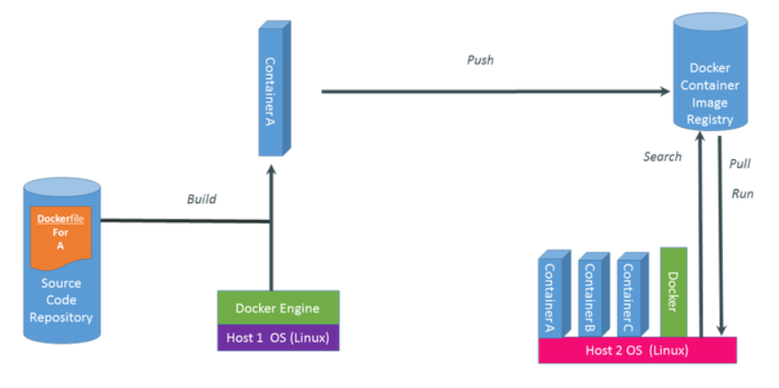

## Tổng quan về Docker 

### 1, Docker là gì?
- Docker là một nền tảng để cung cấp cách để building, deploying và running ứng dụng dễ dàng hơn bằng cách sử dụng các containers (trên nền tảng ảo hóa). Ban đầu viết bằng Python, hiện tại đã chuyển sang Golang.

### 2, Container trong Docker là gì?
Các containers cho phép lập trình viên đóng gói một ứng dụng với tất cả các phần cần thiết, chẳng hạn như thư viện và các phụ thuộc khác, và gói tất cả ra dưới dạng một package.

- Bằng cách đó, nhờ vào container, ứng dụng sẽ chạy trên mọi máy Linux khác bất kể mọi cài đặt tùy chỉnh mà máy có thể có khác với máy được sử dụng để viết code.

  #### Ưu điểm của Docker 

- <b>Tính dễ ứng dụng </b> : Docker rất dễ cho mọi người sử dụng từ lập trình viên, sys admin… nó tận dụng lợi thế của container để build, test nhanh chóng. Có thể đóng gói ứng dụng trên laptop của họ và chạy trên public cloud, private cloud… Câu thần chú là “Build once, run anywhere”.
- <b>Tốc độ</b>: Docker container rất nhẹ và nhanh, bạn có thể tạo và chạy docker container trong vài giây.
- <b>Môi trường chạy và khả năng mở rộng</b>: Bạn có thể chia nhỏ những chức năng của ứng dụng thành các container riêng lẻ. Ví dụng Database chạy trên một container và Redis cache có thể chạy trên một container khác trong khi ứng dụng Node.js lại chạy trên một cái khác nữa. Với Docker, rất dễ để liên kết các container với nhau để tạo thành một ứng dụng, làm cho nó dễ dàng scale, update các thành phần độc lập với nhau.
  
#### Chức năng của các thành phần trong Docker

- <b>Docker Engine</b> : là thành phần chính của Docker, như một công cụ để đóng gói ứng dụng
- <b>Docker Hub</b> : là một “github for docker images”. Trên DockerHub có hàng ngàn public images được tạo bởi cộng đồng cho phép bạn dễ dàng tìm thấy những image mà bạn cần. Và chỉ cần pull về và sử dụng với một số config mà bạn mong muốn.
- <b>Images</b>: là một khuôn mẫu để tạo một container. Thường thì image sẽ dựa trên 1 image có sẵn với những tùy chỉnh thêm. Ví dụ bạn build 1 image dựa trên image Centos mẫu có sẵn để chạy Nginx và những tùy chỉnh, cấu hình để ứng dụng web của bạn có thể chạy được. Bạn có thể tự build một image riêng cho mình hoặc sử dụng những image được chia sẽ từ cộng đồng Docker Hub. Một image sẽ được build dựa trên những chỉ dẫn của Dockerfile.
<b>Container</b>: là một instance của một image. Bạn có thể create, start, stop, move or delete container dựa trên Docker API hoặc Docker CLI.
<b>Docker Client</b>: là một công cụ giúp người dùng giao tiếp với Docker host.
<b>Docker Daemon</b>: lắng nghe các yêu cầu từ Docker Client để quản lý các đối tượng như Container, Image, Network và Volumes thông qua REST API. Các Docker Daemon cũng giao tiếp với nhau để quản lý các Docker Service.
<b>Dockerfile</b>: là một tập tin bao gồm các chỉ dẫn để build một image .
<b>Volumes</b>: là phần dữ liệu được tạo ra khi container được khởi tạo.

#### Quy trình thực thi của một hệ thống sử dụng Docker

## 2, Cài đặt và định cấu hình Docker Swarm trên CentOS 7
giới thiệu tại đây : https://medium.com/@Alibaba_Cloud/how-to-install-and-configure-docker-swarm-mode-on-centos-7-c0b32f0fbc82

Docker Swarm là một công cụ phân cụm riêng cho các vùng chứa Docker có thể được sử dụng để quản lý một cụm các nút Docker như một hệ thống ảo duy nhất. Docker Swarm cho phép bạn thêm hoặc bớt các lần lặp lại vùng chứa khi nhu cầu tính toán thay đổi. Docker Swarm bao gồm hai thành phần chính là nút Manager và nút Worker. Nút trình quản lý được sử dụng để xử lý các tác vụ quản lý cụm, chẳng hạn như, duy trì trạng thái cụm, lập lịch dịch vụ và phục vụ các điểm cuối HTTP API chế độ bầy đàn. Nút công nhân là một ví dụ của công cụ Docker có thể được sử dụng để thực thi vùng chứa. Trình quản lý Swarm cho phép bạn tạo một cá thể người quản lý chính và nhiều bản sao trong trường hợp phiên bản chính bị lỗi. Bạn có thể triển khai các nút quản lý và nhân viên trong thời gian chạy ở chế độ Swarm của công cụ Docker. Trong hướng dẫn này,

### 1, Yêu cầu
Ba phiên bản đám mây của Alibaba có cài đặt CentOS 7. Trong số đó một lần máy chủ sẽ hoạt động như một nút Trình quản lý và hai máy chủ sẽ hoạt động như nút Công nhân.
Địa chỉ IP tĩnh được định cấu hình trên tất cả các phiên bản. Ở đây, chúng ta sẽ sử dụng địa chỉ IP 192.168.0.102 cho nút Manager, 192.168.0.103 cho Worker node1 và 192.168.0.104 cho Worker node2.
### 2, Bắt đầu
Trước khi bắt đầu, bạn sẽ cần cấu hình tệp / etc / hosts trên mỗi nút, vì vậy mỗi nút có thể giao tiếp với nhau bằng tên máy chủ. Bạn có thể cập nhật tệp / etc / hosts trên mỗi nút như hình dưới đây: nano / etc / hosts

>192.168.0.102  managernode
192.168.0.103  workernode1
192.168.0.104  workernode2

Lưu và đóng tệp khi bạn hoàn tất. Tiếp theo, bạn sẽ cần phải định cấu hình tên máy chủ trên mỗi nút theo tệp / etc / hosts. Bạn có thể thực hiện việc này bằng cách chạy lệnh sau trên từng nút một: <b> Nút trình quản lý: </b>

>hostnamectl set-hostname managernode

-Nút công nhân1:

>hostnamectl set-hostname workernode1

-Nút công nhân2

>hostnamectl set-hostname workernode2

### 3, Cài đặt Docker Engine
Tiếp theo, bạn sẽ cần cài đặt Docker Community Edition trên tất cả các nút. Theo mặc định, phiên bản mới nhất của Docker CE không có sẵn trong kho lưu trữ CentOS 7. Vì vậy, bạn sẽ cần thêm kho lưu trữ Docker CE vào hệ thống của mình. Bạn có thể thực hiện việc này bằng cách chạy lệnh sau trên tất cả các nút:

> wget https://download.docker.com/linux/centos/docker-ce.repo -O /etc/yum.repos.d/docker.repo 
- Sau khi Kho lưu trữ Docker đã được cài đặt, hãy chạy lệnh sau để cài đặt Docker CE:

> yum install docker-ce –y

- Tiếp theo, khởi động dịch vụ Docker và cho phép nó bắt đầu khi khởi động bằng lệnh sau:

>systemctl start docker
systemctl enable docker

###4, Định cấu hình tường lửa

- Tiếp theo, bạn sẽ cần mở các cổng 7946, 4789, 2376, 2377 và 80 trên tường lửa để một cụm bầy hoạt động bình thường. Chạy lệnh sau trên tất cả các nút:

>firewall-cmd --permanent --add-port=2376/tcp
firewall-cmd --permanent --add-port=2377/tcp
firewall-cmd --permanent --add-port=7946/tcp
firewall-cmd --permanent --add-port=80/tcp
firewall-cmd --permanent --add-port=7946/udp
firewall-cmd --permanent --add-port=4789/udp

- Cuối cùng, tải lại tường lửa và dịch vụ Docker để áp dụng tất cả các thay đổi:

> firewall-cmd --reload
systemctl restart docker

