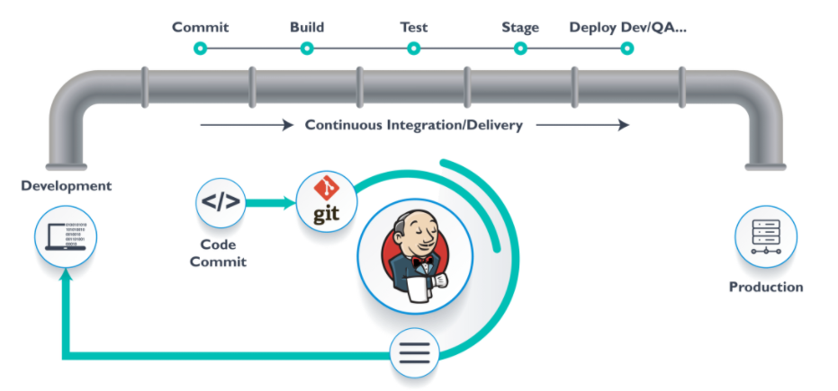
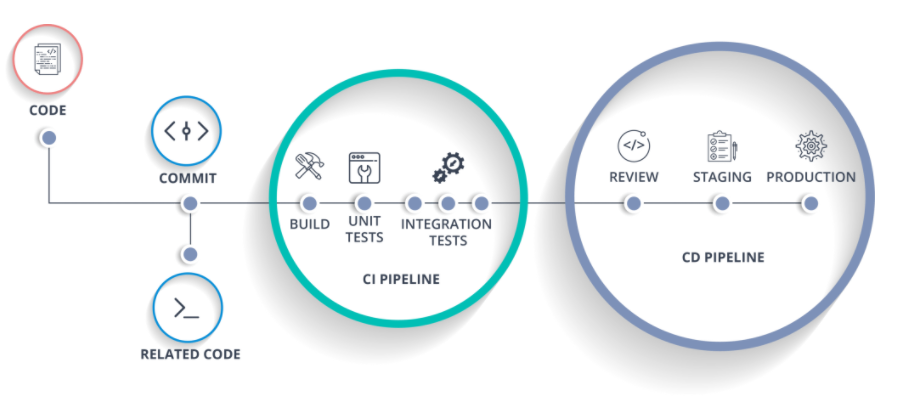

##I, Tổng quan về Jenkins
###1, Jenkins là gì?
- Jenkins là một opensource dùng để thực hiện chức năng tích hợp liên tục (gọi là CI – Continuous Integration) và xây dựng các tác vụ tự động hóa.

- Nó tích hợp các source code của các members trong team lại nhanh chóng một cách liên tục, theo dõi sự thực thi và trạng thái thông qua các bước kiểm thử (Integration test, units test). Tất nhiên là nhằm giúp sản phẩm chạy ổn định
###2, CI là gì? CD là gì?

- CI là viết tắt của Continuous Integration
Là tích hợp liên tục, nhằm liên tục tích hợp các source code của các thành viên trong team lại một cách nhanh chóng.
- Chu trình làm việc:
 1. Bước đầu tiên, các thành viên trong team dev sẽ bắt đầu pull code mới nhất từ repo về branch để thực hiện các yêu cầu chức năng nhất định.
2. Tiếp đó là quá trình lập trình và test code để đảm bảo chất lượng của chức năng cũng như toàn bộ source code.
3. Thành viên code xong thì sẵn sàng cho việc commit vào branch develop của team.
4. Thành viên cập nhật code mới từ repo về local repo
5. Merge code và giải quyết conflict.
6. Build và đảm bảo code pass qua các tests dưới local.
7. Commit code lên repo
8. Máy chủ CI lắng nghe các thay đổi code từ repository và có thể tự động build/test, sau đó đưa ra các thông báo (pass/failure) cho các thành viên.

##II, Cài đặt Jenkins trên CentOS-7
###1, Cập nhật hệ thống CentOS 7 của bạn.
>sudo yum install epel-release
sudo yum update

###2, Cài đặt Java.
- Trước khi cài đặt Jenkins, bạn cần cài đặt java trong máy của mình. hãy cài đặt phiên bản mới nhất của OpenJDK Runtime Environment 1.8.0

> sudo yum install java-1.8.0-openjdk.x86_64

- Sau khi cài đặt Java, bạn có thể xác minh nó bằng cách chạy lệnh đang chạy.

> java -version

###3, Cài đặt Jenkins.
- Bắt đầu bằng cách nhập khóa kho lưu trữ từ Jenkins.
> rpm --import https://pkg.jenkins.io/redhat-stable/jenkins.io.key

- Sau khi nhập khóa, hãy thêm kho vào hệ thống.

>sudo wget -O /etc/yum.repos.d/jenkins.repo http://pkg.jenkins-ci.org/redhat/jenkins.repo

- Bây giờ cài đặt gói Jenkins bằng yum:

>sudo yum install jenkins
- Bây giờ bạn có thể bắt đầu dịch vụ Jenkins bằng cách sử dụng:

>sudo systemctl start jenkins
sudo systemctl enable jenkins
sudo systemctl status jenkins

- Bật cổng 8080 / tcp trên tường lửa.

> sudo firewall-cmd --add-port=8080/tcp --permanent
sudo firewall-cmd --reload
sudo firewall-cmd --list-all
Service should be listening on port 8080:
netstat -tunelp | grep 8080
tcp    LISTEN     0      50       :::8080  

- LỖI: FirewallD không chạy
- Khắc phục sự cố : Khởi động Firewalld, để khởi động firewalld, hãy chạy lệnh sau dưới dạng root:

> systemctl start firewalld

LỖI: không tìm thấy lệnh netstat  Khắc phục:

> yum install net-tools
netstat -v

- Duyệt đến URL http: // [serverip | hostname]: 8080 để truy cập trình hướng dẫn cài đặt web. (Vi du: http://10.19.2.60:8080/login?from=%2F ) Khi bạn lần đầu tiên truy cập phiên bản Jenkins mới, bạn được yêu cầu mở khóa bằng mật khẩu được tạo tự động.

- Sử dụng lệnh sau để in mật khẩu trên thiết bị đầu cuối của bạn:

> sudo cat /var/lib/jenkins/secrets/initialAdminPassword
- Bạn sẽ thấy mật khẩu gồm cả chữ và số dài 32 ký tự như hình dưới đây:

> 95b41ce7dba641898440df658fee6b8e

- Sao chép mật khẩu và dán nó vào các cửa sổ trên và nhấp vào tiếp tục. Trong cửa sổ tiếp theo Chọn tùy chọn: Cài đặt các plugin được đề xuất

- quá trình cài đặt plugin bắt buộc đang diễn ra. Sau khi cài đặt xong plugin. Nó sẽ yêu cầu tạo một người dùng Admin.

<b> Jenkins đã sẵn sàng, thiết lập công việc tự động hóa của bạn với Jenkins. </b>
